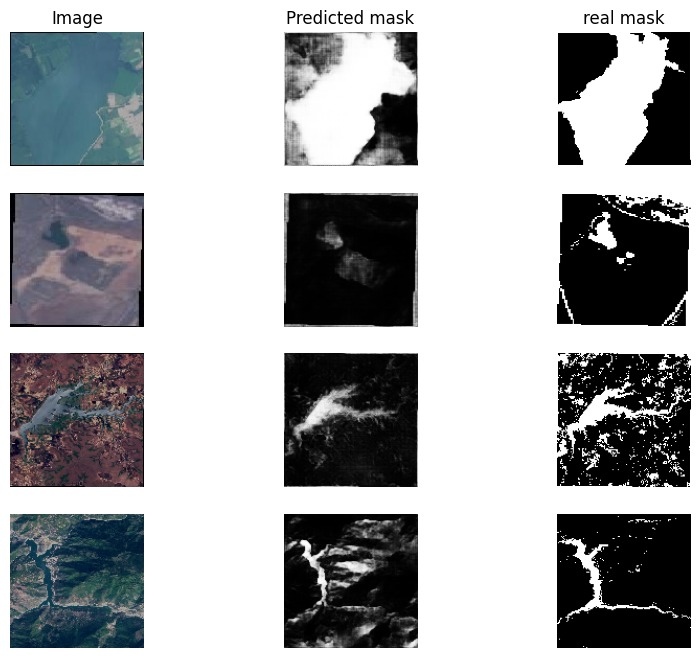

In this project I developed an AI model for image segmentation focused on water bodies. By implementing the U-Net architecture and applying data augmentation, the model accurately delineates water areas within images, generating precise masks that highlight the water's presence.

### Technologies Used:

- **keras**: user-friendly deep learning library for building and training neural networks in Python.
- **TensorFlow**: The machine learning framework that powers the image classification model.
- **Python**: The programming language used for developing the classifier and the FastAPI application.
- **NumPy**: A library for numerical operations, essential for data manipulation in the model.

### Project Components:

1. **Dataset**: The model is trained on a dataset obtained from [kaggle](https://www.kaggle.com/datasets/franciscoescobar/satellite-images-of-water-bodies), it contains images of 2841 water bodies with multiple shapes. all of these data went through a data augmentation process to add the images shifted vertically and horizontaly to the dataset.

2. **TensorFlow Model**: The model was created using the U-Net architecture, wich consists of an encoder and a decoder and some skip connections between them. The image below ilustrates the architecture.

