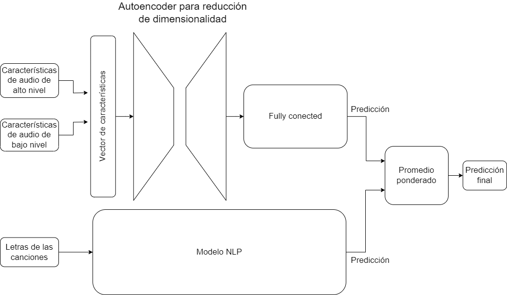

The while title is: "MusIkA: Tool for predicting the potential popularity of Pop/Rock genre songs on digital platforms using Artificial Intelligence" and it is the project I worked on as my thesis. As the tittle suggests it the main focus was to develop a model based on artificial intelligence to predict the popularity of songs. To achieve this, we constructed a dataset comprising 39,397 song lyrics, alongside 30,671 audio files in MP3 format, including their high and low-level audio features. Subsequently, we explored various artificial intelligence models for popularity prediction. The results revealed a prediction accuracy of 58% using these models.

### Technologies Used:

- **keras**: user-friendly deep learning library for building and training neural networks in Python.
- **TensorFlow**: The machine learning framework that powers the image classification model.
- **Python**: The programming language used for developing the classifier and the FastAPI application.
- **NumPy**: A library for numerical operations, essential for data manipulation in the model.
- **Pandas**: a fast, powerful, flexible and easy to use open source data analysis and manipulation tool.
- **Selenium**: Python library and tool used for automating web browsers to do a number of tasks. In this case, web-scrapping.
- **pydeezer**: Python library used to ibtain songs information from deezer. In this project we used it to obtain the list of the songs and download most the songs.
- **pytube**: Python library to download songs from youtube.
- **Spotipy**: Python library used to ibtain songs information from spotipy. In this project we used it to obtain the list of the songs and the high-level features.
- **Librosa**: Python library used to analyse the mp3 files and obtain the low-level features.

### Project Components:

1. **Datased**: we constructed a dataset comprising 39,397 song lyrics, alongside 30,671 audio files in MP3 format, including their high and low-level audio features. For this purpose we used multiple python libraries such as Pandas, Selenium, pydeezer, pytube, Spotipy and Librosa.

2. **Model architecture**: in the image below you can see the architecture proposed in the project.
